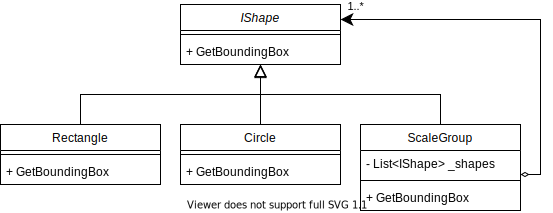

# Composite

In this kata you implement the Gang Of Four Composite Pattern [[1](#ref-1), [2](#ref-2), [3](#ref-3)].

## Problem Description

Idea of this kata: We create a program to handle geometric shapes. The program shall calculate a rectangle into which a
set of geometric shapes fit. This is the so called bounding box.

## Intended Design

Use the Composite pattern to create a tree of Rectangle, Circle and ScaleGroup objects. The ScaleGroup is the composite
which contains a list of shapes (IShape objects). An implementation may look as depicted here.



| Class(es) | Description
| --------- | -----------
| `IShape` | Specifies that every shape must provide a method to calculate the bounding box
| `Rectangle`, `Circle` | Simple shapes together with their custom bounding box calculation
| `ScaleGroup` | Composite object aggregating a list of `IShape` objects including instances of itself

## Kata Instructions

Simplification: When developing the program, assume that the user will always enter correct data - skip input
validation.

The requirements listed in the following will guide the application development step by step.

- Create a console program which allows to enter a rectangular shape. This means, the program allows to input "rect 1,
  2, 10, 20", which represents a rectangle with the top left coordinate (1, 2), width 10 and height 20.

- The program shall print the top left and bottom right coordinate for the entered rectangle. In the above case, the
  program shall print "(1, 2) (11, 22)".

- Extend the program such that one can enter several shapes line by line. Entering an empty line shall end shape
  entering.

- After an empty line has been entered, the program shall print out the top left and bottom right coordinates of the
  smallest rectangle into which all entered shapes fit.

Example:

User input:

```text
rect 5 5 5 10
rect 8 8 1 10

```

The last line is a blank line, i.e. the user just hits enter.

Program output:

```text
(5, 5) (15, 18)
```

- Extend the program such that the user can also add circles. The associated input is `circ 1 2 5` where the
    - `1` represents the center x coordinate
    - `2` represents the center y coordinate
    - `5` represents the radius of the circle
    - For circles the program considers a bounding box which fits exactly around the circle. In this case, the bounding
      box would be `(-4, -3) (6, 7)`.

- Extend the program such that the user can group shapes together and scale them. Associated input shall look as
  follows:

User input for a single shape

```text
scale group 0.1
circle 15 25 5
end group
```

Program output

```text
(10, 20) (11, 21)
```

The top left coordinate of the bounding box is kept. The width and height of the bounding box are scaled by the same
factor.

User input for scaling a group of shapes:

```text
scale group 0.1
rect 20 20 100 100
circle 170 170 50
end group
```

This shall group two shapes and then shrink the width and height of the entire group by a factor of 0.1 each. The top
left of the bounding box of the group shall stay the same, only the bottom right is adjusted. In this particular
example, the program shall print

```text
(20, 20) (40, 40)
```

- Finally, the program shall allow nesting scale groups (note that this requirement might be fulfilled automatically by
  the previous programming steps).

User input

(The text after and including the '#' is not entered. It is a comment explaining the bounding rect at that stage. Start
with the innermost scale group.)

```text
rect 0 0 5 5         # (0, 0) (5, 5)
scale group 0.5      # (10, 0) (40, 30) -> (10, 0) (25, 15)
rect 10 10 20 20     # (10, 10) (30, 30)
circle 20 20 10      # (10, 10) (30, 30)
scale group 0.1      # (20, 0) (220, 200) -> (20, 0) (40, 20)
circle 120 100 100   # (20, 0) (220, 200)
end group
end group 
```

Program output

```text
(0, 0) (25, 15)
```

## Generating Documentation

You can use [Doxygen](https://www.doxygen.org) to generate source code documentation and diagrams. From a folder
containing a `Doxyfile` just run

````shell
doxygen
````

This will work best if you have the [graphviz dot tool](https://graphviz.org/) installed.

The documentation will be generated into an `html` folder. Start by opening the `html/index.html` file.

## References

<a name="ref-1">[1]</a> John Somnez and others: "Composite" in "Pluralsight: Design Patterns Library"
, https://www.pluralsight.com/courses/patterns-library, last visited on Aug. 18, 2021.

<a name="ref-2">[2]</a> Erich Gamma, Richard Helm, Ralph Johnson, John Vlissides: "Design Patterns: Elements of Reusable
Object-Oriented Software", Addison Wesley, 1994, pp.
151ff, [ISBN 0-201-63361-2](https://en.wikipedia.org/wiki/Special:BookSources/0-201-63361-2).

<a name="ref-3">[3]</a> Wikipedia: "Facade Pattern", https://en.wikipedia.org/wiki/Composite_pattern, last visited on
Aug. 18, 2021.